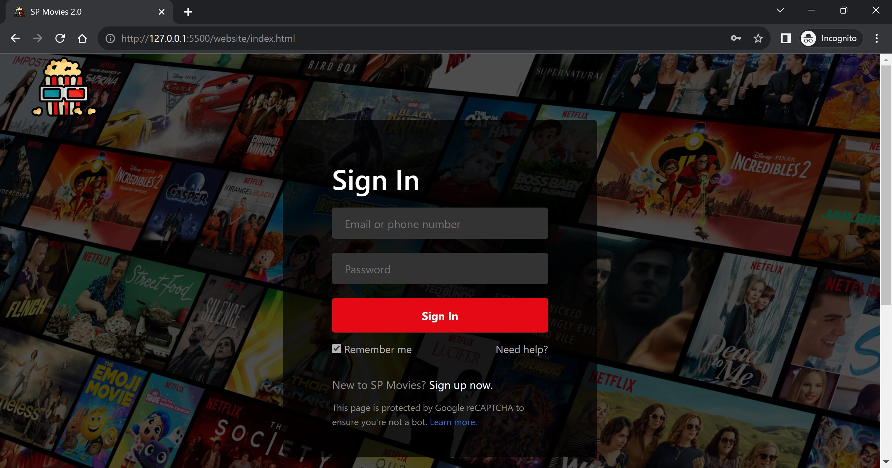

# IT8907-FCP Assignment (CA1 & CA2) - Movie Management System

This full-stack web application allows an admin to manage a list of movies in the system. Using this application, the admin can:

- Retrieve a list of movies
- Toggle hide/show past movies
- Filter movies by genre
- Create movies
- Delete one or multiple movie(s)
- Update movies
- Pin movies

It also allows a normal user to retrieve/toggle/filter a list of movies & to pin their favourite movies.

## Languages used:

HTML5, CSS3, JavaScript, SQL

## Libraries/Frameworks used:

Frontend Tech Stack:

- React.js, Redux, React-Router-DOM, Bootstrap 5, MDBootstrap 5, React-Icons, React-Spinners, Babel, Webpack, GitHub Pages (for hosting Frontend App)

Backend Tech Stack:

- Node.js, Express.js, MySQL, AWS (for hosting Backend App)

## Installation & Local usage instructions:

To run the web application locally, follow the steps below:

1. Clone the repository using `git clone <REPOSITORY_ADDRESS>` command & Open the repository using a code editor like VS Code.
2. At the root of the project, you should see 2 folders titled `website` & `server`. The 3rd folder `.github` contains various automation related scripts that are used by GitHub Actions to automatically add reviewers & assignees to pull requests (**advanced feature**).
3. Open the first terminal window & change directory into the `server` folder by entering the commands `cd server`. Once there, install all the dependencies using `npm install` command.
4. Start the server using the command `nodemon server.js`.
5. Open a second terminal window & change directory into the `website` folder by entering the command `cd website`. Once there, install all the dependencies using `npm install` command.
6. Run the command `npm run start` to allow Babel to transpile the code. An `/output` folder should appear after transpilation.
7. Open a third terminal window & `cd website`. This time round, run the command `npm run build` to allow Webpack to transpile once again and bundle the code. A `/dist` folder should appear after transpilation.
8. Right click the index.html file (in the root directory) & click on 'Open with Live Server' to start the web application. To open the HTML file with a local development live server, please kindly ensure that you have installed beforehand the [Live Server extension](https://marketplace.visualstudio.com/items?itemName=ritwickdey.LiveServer) in your VS Code editor.
9. Check & ensure that your website is started at ***http://127.0.0.1:5500*** and your server is started at **_http://localhost:8081_**.
10. Once your website & server are set up locally, proceed to open MySQL workbench and create a local database using the provided SQL script in the `/sql` folder of the /server directory. The SQL script is titled `Dump20230125.sql`.
11. Depending on your MySQL workbench settings, you might also need to change lines 8 & 9 in the `/server/model/databaseConfig.js` file to match your own MySQL workbench username & password. This is done so that the server can connect to the locally generated database (from step 11 earlier).
12. Since this code repository is configured for cloud deployment, if you wish to test it locally instead, you would need to change a few parameters (to the localhost variant) such as:
    - Line 17 in `constants.js` file (API_HOST variable)
    - Line 6 in `databaseConfig.js` file (host parameter)

## Login credentials:

- **Admin Credentials (Admin Account):**

  - Email: `admin@gmail.com`
  - Password: `password123`

- **User Credentials (Public Account):**

  - Email: `user@gmail.com`
  - Password: `password123`

- Take note Admin Account has **ALL** functionalities while the Public User Account has only **RESTRICTED/LIMITED** functionalities.

## Things to take note:

1. Only **ONE** login session is allowed at anytime. When you wish to end your session, kindly make sure to click the 'Logout' button.
2. If running the full-stack app locally:

   - Ensure both your website & server are running at the correct ports - i.e. Website (***http://127.0.0.1:5500***) & Server (**_http://localhost:8081_**)

   - If you are facing issues logging in despite entering the correct email & password AND have ensured that your website & server are running at the correct ports, as a last resort, please kindly clear your browser's cache & cookies.

   - Your browser might still contain the cookie with the JWT token, hence this might cause future login attempts to fail. Clearing the cookies in your browser will resolve this issue.

   - If you are facing server-side/backend related issues, it could be due to the custom middleware `verifyAgainstCSRFAttacks` which I (Melvin) have written in verificationLib.js. In short, this is a custom middleware that helps to mitigate against CSRF attacks by blocking out requests that came from untrusted/unauthorized origins.

   - You can **disable** that particular middleware by commenting out Line 65 in app.js - `app.use(verificationLib.verifyAgainstCSRFAttacks)` if it's causing backend related issues when you are testing the application locally.

   - On our end, as a team, we have tested the application locally and all the features work fine with that custom protective middleware enabled 😊

3. If for any reason, you wish to test our backend API endpoints via Postman, you can do by finding the relevant Postman collections in the `/postman` folder of the server directory. Import those Postman collections to your desktop Postman app, and you can start testing the API endpoints.
4. However, do take note that when hitting Admin protected API endpoints via Postman, in your Request Header, please remember to manually add a Cookie header accompanied with the relevant JWT token/value. This step is important for admin protected APIs. Without it, admin APIs will return an unauthorized error object. You can refer to a document titled `Postman_Testing_FYI.pdf` in the postman folder for more details.

## Done by:

Class 1 Team 1:

1. Ng Cheng Wai Melvin (P7411407) 😎 - **Team Leader**
2. Kua Zi Lin (P7461142) 👿 - **Team Member**
3. Ng Chye Yong (P7461085) 🥶 - **Team Member**

We had regular standups to update each other on our progress & to ensure that the project deliverables (and many additional features) are met within the stipulated timeline.

Our GitHub Projects Kanban Board can be found here: https://github.com/orgs/SP-CET-Capstone/projects/11/views/1

## Live Demo:

https://sp-cet-capstone.github.io/capstone-assignment-class-1-team-1/website/index.html

Frontend App:

- Hosted on **GitHub Pages**

Backend App:

- Hosted on **AWS** (utilizing various AWS services such as EC2, RDS, Route53, ACM, ALB)
- Utilizing a .tech domain: https://movies.sp-cet-capstone-backend.tech

© 2023 IT8907-FCP Class 1 Team 1
